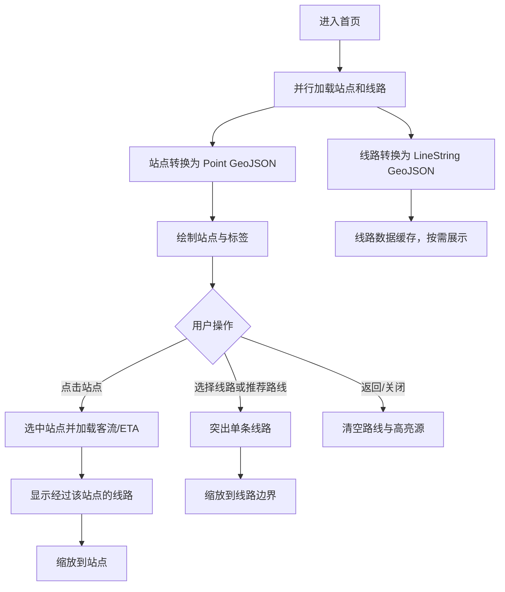

# BusMind 前端接口需求、页面接入与地图绘制说明

> [!info] 文档基线
> 本文依据 2026-07-13 工作区中的 `frontend/src` 静态代码更新，重点区分“API 已封装”“页面已调用”“已完成运行时联调”三个层次。本文没有重新启动后端做在线接口验证，因此“已接入”表示页面代码存在真实调用及成功/失败处理，不代表当前环境中的数据一定可用。

## 一、前端结构与统一约定

### 1.1 当前目录职责

当前前端已采用“路由入口 + 业务模块 + API 边界”的结构：

- `frontend/src/views/**`：Vue Router 的轻量入口，只负责挂载对应业务页面。
- `frontend/src/modules/**/components`：页面状态、交互与业务编排的真实实现位置。
- `frontend/src/api/**`：Axios 请求封装、请求参数和响应边界。
- `frontend/src/modules/map/components/BusMap.vue`：地图实例、GeoJSON 转换、图层、选中、高亮和视野控制。
- `frontend/src/modules/map/constants/map-style.js`：Protomaps/PMTiles 底图配置。

维护接口接入状态时，应检查 `src/modules` 中的组件，不能只检查 `src/views` 或 `src/api`。

### 1.2 HTTP 与鉴权约定

- Axios 实例位于 `frontend/src/api/request.js`。
- 开发环境默认地址为 `http://127.0.0.1:8001/api/v1`，生产环境默认 `/api/v1`，均可由 `VITE_API_BASE_URL` 覆盖。
- 默认请求超时为 20 秒；推荐路线接口单独使用 `VITE_RECOMMENDATION_TIMEOUT`，默认 60 秒。
- 响应拦截器直接返回后端统一外壳 `{ code, message, data, trace_id, timestamp }`，页面业务数据通常读取 `response.data`。
- `code !== 0` 会被转换为 rejected Promise；页面应通过 `getApiErrorMessage` 统一提取错误文案。
- Bearer Token 从 `sessionStorage` 读取；登录成功使用 `saveAuthSession` 保存 Token 和用户。
- HTTP 401 会清理本地 Token 和用户缓存；路由守卫负责登录页、普通用户页面和管理员页面跳转。
- `trace_id` 已有 `getTraceId` 适配函数，但现有页面尚未展示，建议在错误提示或日志面板中补充。

### 1.3 字段与业务口径

| 前端概念 | 后端字段/来源 | 前端处理 |
|---|---|---|
| ETA | `predicted_eta_minutes` | 历史命名保留；业务文案按当前实现称“实时 ETA / LTA”，不要写成自研模型预测 |
| 客载 | `predicted_load_level`、`predicted_load_rate` | 映射为有座位、可站立、站立空间有限、过度拥挤 |
| 站点客流 | `total_tap_in`、`total_tap_out`、`total_flow` | 属于 Passenger Flow，不等于车辆内 Passenger Load |
| 路线评分 | `experience_score` | 推荐卡片保留一位小数 |
| 实体标识 | `route_id`、`line_id`、`station_id`、`vehicle_id` | 不应继续用无类型的通用 `id` 猜测实体 |
| 推荐偏好 | `balanced`、`fastest`、`comfort`、`less_walking`、`less_transfer` | 正式页面应发送上述值；`low_load` 只作为 AI 兼容值存在 |

## 二、页面接入总览

| 路由 | 真实业务组件 | 页面实际调用 | 静态/本地内容 | 当前结论 |
|---|---|---|---|---|
| `/login` | `modules/auth/components/LoginPage.vue` | 登录、当前用户 | Logo 占位 | 已接入 |
| `/register` | `modules/auth/components/RegisterPage.vue` | 邮箱验证码、注册 | 无业务 Mock | 已接入 |
| `/home` | `modules/home/components/HomePage.vue`、`modules/map/components/BusMap.vue` | 地图、搜索、附近站点、推荐、ETA、车辆、客流、AI、到站刷新 | 天气/穿衣/出行提示为静态 | 核心功能已接入，地图仍有绘制缺陷 |
| `/ai` | `modules/ai-assistant/components/AiAssistantPage.vue` | AI 出行问答 | 初始欢迎语、快捷问题 | 已接入 |
| `/lines` | `modules/line/components/LineListPage.vue` | 线路分页与搜索 | 无业务 Mock | 已接入 |
| `/lines/:id` | `modules/line/components/LineDetailPage.vue` | 详情、站序、车辆、ETA、客载、历史记录 | 无业务 Mock | 已接入 |
| `/vehicles` | `modules/vehicle/components/VehiclePage.vue` | 线路、车辆、车辆详情、ETA、客载 | 无业务 Mock | 已接入；地图位置仍为文本展示 |
| `/passenger-flow` | `modules/passenger-flow/components/PassengerFlowPage.vue` | 历史客流、线路、客载历史 | 无业务 Mock | 已接入 |
| `/profile` | `modules/profile/components/ProfilePage.vue` | 用户、收藏、查询历史、更新昵称、取消收藏 | 默认联系方式、偏好权重和无历史时平均等待为静态兜底 | 部分接入 |
| `/admin` | `modules/admin/components/AdminPage.vue` | 健康检查、统计、线路/站点/车辆 CRUD、站序维护、LTA 刷新 | 无业务 Mock | 已接入，受 admin 路由守卫保护 |

## 三、逐页面接口接入说明

### 3.1 登录 `/login`

| 项目 | 内容 |
|---|---|
| 请求 | `POST /users/login`；必要时 `GET /users/me` |
| 触发 | 提交账号和密码 |
| 请求字段 | 页面将 `account` 去空格后映射为 `username`，同时发送 `password` |
| 使用字段 | `data.access_token`、`data.user.role`；登录响应没有完整角色时再请求 `/users/me` |
| 成功行为 | 保存会话；管理员进入 `/admin`，其他用户进入 `/home` |
| 失败行为 | 清理会话并展示统一错误 |
| 风险 | 页面没有“记住我”，当前会话关闭后 Token 失效；这与 `saveAuthSession` 默认写入 `sessionStorage` 一致 |

### 3.2 注册 `/register`

| 项目 | 内容 |
|---|---|
| 请求 | `POST /users/register/email-code`；`POST /users/register` |
| 触发 | 发送验证码；提交注册表单 |
| 请求字段 | `username`、`nickname`、`email`、`verification_code`、`password`、`password_confirm` |
| 前端校验 | 用户名 4–32 位、邮箱格式、6 位数字验证码、密码 8–64 位、两次密码一致 |
| 成功行为 | 跳转 `/login?registered=1` |
| 风险 | 倒计时定时器没有在组件卸载时显式清理；不影响接口契约，但建议补 `onBeforeUnmount` |

### 3.3 首页与地图 `/home`

| 业务 | 接口 | 触发与用途 |
|---|---|---|
| 站点绘制 | `GET /map/stations`，5xx/网络错误时回退 `GET /locations/map/stations` | `BusMap` 挂载时加载；转换为点 GeoJSON |
| 线路绘制 | `GET /map/lines`，5xx/网络错误时回退 `GET /lines` | `BusMap` 挂载时加载；转换为线 GeoJSON |
| 线路几何回退 | `GET /map/road-segments` | `/map/lines` 中存在缺失 `path_coordinates` 的线路时合并分段 |
| 起终点搜索 | `GET /locations/search` | 提交检索时并行搜索起点与终点，各取第一条结果 |
| 浏览器定位 | `GET /locations/nearby` | 获取经纬度后查询 2 公里内最近站点 |
| 路线推荐 | `POST /recommend-routes` | 使用站点 ID、`balanced`、允许换乘、最多 2 次换乘 |
| 站点客流 | `GET /history/passenger-flow` | 点击站点后按 `station_id`、小时粒度加载 |
| 站点 ETA | `GET /vehicles/realtime` + `GET /eta` | 点击站点后取关联线路第一辆车，再查询该车到站 ETA |
| AI | `POST /ai/travel` | 有已解析起终点时用 `suggest`，否则用 `qa` |
| 到站刷新 | `POST /users/me/refresh-arrivals` | 地图初始站点/线路请求结束后触发，失败被静默忽略 |

首页已不再使用路线、站点或 AI 业务 Mock，但仍有以下静态内容：天气、穿衣、提前出发建议和客流生活卡片；这些内容当前没有天气或城市服务接口支持。

推荐结果先保存在 `rawRouteOptions`，再由 `normalizeRecommendation` 转成卡片需要的 `title/eta/score/load/status/chart`。点击候选路线时，页面把推荐路线的首个 `line_id` 交给地图聚焦；因此多段换乘路线目前只会高亮一条公交线，不会完整绘制整个行程。

### 3.4 AI 助手 `/ai`

| 项目 | 内容 |
|---|---|
| 请求 | `POST /ai/travel` |
| 页面请求 | 当前独立 AI 页发送固定 `mode: qa` 及用户问题；首页 AI 会按是否已有站点对切换 `qa/suggest` |
| 使用字段 | `data.answer`；首页还读取 `data.related_routes[0]` |
| 降级 | 请求失败时显示后端错误，不伪造固定答案 |
| 待补 | 展示 `fallback`、`used_tools`、`reminders`、`trace_id`；首页将“舒适”映射为兼容值 `low_load`，建议统一为 `comfort` |

### 3.5 线路列表 `/lines`

| 项目 | 内容 |
|---|---|
| 请求 | `GET /lines?page&limit&line_name?` |
| 触发 | 首次挂载、输入后 350ms 防抖、回车、翻页 |
| 使用字段 | `line_id`、`line_name/service_no/line_code`、起终点、方向、站点数、首末班、运营商、总数 |
| 额外过滤 | 隐藏 `line_code` 含 `{{` 或 `line_name` 含 `postman test` 的测试数据 |
| 风险 | 过滤发生在分页结果返回之后，页面显示条数可能小于 `limit`，而 `total` 仍是后端未过滤总数 |

### 3.6 线路详情 `/lines/:id`

页面加载流程：

1. 并行请求 `GET /lines/{id}` 和 `GET /lines/{id}/stations`；站序请求失败时回退详情响应中的 `stations`。
2. 再并行加载实时车辆、线路 ETA 历史和线路客载历史。
3. 实时车辆优先 `GET /vehicles/realtime?line_id=...`，为空时回退 `GET /vehicles/line/{id}`。
4. 默认选择第一辆车和第一个站点；车辆或站点变化时并行请求 `GET /eta` 与 `POST /passenger-load-prediction`。

页面使用接口：

- `GET /lines/{id}`
- `GET /lines/{id}/stations`
- `GET /vehicles/realtime`
- `GET /vehicles/line/{id}`
- `GET /eta`
- `POST /passenger-load-prediction`
- `GET /history/eta/line/{id}`
- `GET /history/load/line/{id}`

页面已分别展示基础资料、真实站序、LTA ETA、客载结果以及历史记录。需注意 `predictPassengerLoad` 的文案目前写“实时客载”，若该接口实际为预测计算，应按后端口径改为“预计客载”。

### 3.7 车辆 `/vehicles`

| 项目 | 内容 |
|---|---|
| 请求 | `GET /lines`、`GET /vehicles/realtime`，为空时回退 `GET /vehicles`；选中车辆后请求 `GET /vehicles/{id}`、`GET /eta`、`POST /passenger-load-prediction` |
| 触发 | 页面挂载、线路筛选变化、点击车辆、手动刷新 |
| 使用字段 | 车辆编号、线路、当前位置/下一站、状态、人数、容量、经纬度、ETA 与客载 |
| 现状 | 真实接口已接入，但页面没有复用 `BusMap` 绘制车辆 Marker，位置仍以卡片/文本为主 |

### 3.8 历史客流 `/passenger-flow`

| 项目 | 内容 |
|---|---|
| 请求 | `GET /history/passenger-flow`、`GET /lines`、`GET /history/load/line/{line_id}`；线路为空选项时不请求客载 |
| 触发 | 页面挂载、小时/天/周粒度切换、刷新、线路选择 |
| 使用字段 | Passenger Flow 的进站、出站、总量、等级；Passenger Load 的车辆、站点、人数、容量、等级、客载率 |
| 现状 | 已明确区分站点/线路客流与车内客载；`/history/passenger-flow/prediction` 保留在 API 层但页面不调用 |

### 3.9 个人中心 `/profile`

| 项目 | 内容 |
|---|---|
| 请求 | `GET/PATCH /users/me`、`GET /users/me/favorites`、`DELETE /users/me/favorites/{id}`、`GET /users/me/query-history` |
| 触发 | 页面挂载、保存昵称、取消收藏 |
| 已接入 | 用户资料、收藏列表、查询历史、昵称更新、取消收藏 |
| 仍为本地值 | 手机、邮箱、城市缺失时填固定示例；偏好权重固定为舒适 88/速度 72/步行 64；无历史时平均等待固定 6.5 |
| 接口缺口 | 页面尚未调用 `POST /users/me/favorites`；手机号、邮箱、城市和偏好权重也没有实际保存 |

### 3.10 管理端 `/admin`

管理端已由路由守卫要求 Token 和 `user.role === 'admin'`。页面实际接入：

- `GET /health` 类健康检查封装。
- 线路、站点、车辆列表与创建、更新、删除。
- `GET /stations/{id}/lines` 查询站点经过线路。
- 线路站序查询、新增、顺序更新和移除。
- `POST /admin/lta/bus-arrival` 和 Traffic Speed Bands 管理刷新接口。
- 历史客流用于概览统计。

风险点：前端角色守卫只是体验层保护，后端仍必须对所有管理写接口执行 admin 权限校验；手动删除使用 `window.confirm`，批量操作和乐观并发尚未处理。

## 四、线路与站点绘制逻辑说明

### 4.1 业务逻辑

地图的业务原则是“站点常驻、线路按需显示、选中对象突出”：

1. 用户进入首页后，加载真实站点和真实线路几何；地图默认中心为新加坡。
2. 站点是基础可交互对象，点击站点后打开站点详情，并异步补充历史客流和实时 ETA。
3. 默认设计意图是不显示所有线路；用户点击“公交线路图”后，只显示经过当前站点的线路。
4. 用户从站点线路列表选择某条线路，或从推荐结果选择路线后，地图只突出目标线路并将视野缩放到线路范围。
5. 返回检索或关闭线路展示时，清空线路与高亮图层，恢复站点显示。
6. 地图刷新按钮清空全局缓存并重新请求站点、线路。



### 4.2 底图初始化

`BusMap.vue` 在 `onMounted` 中完成：

1. 注册 `pmtiles://` 协议。
2. 通过 `createProtomapsStyle()` 加载本地 `public/tiles/singapore.pmtiles` 与 `singapore-buildings.pmtiles`。
3. 字体和 sprite 仍从 Protomaps 公网加载，因此“地图瓦片本地化”不等于完全离线。
4. 创建 MapLibre 实例，中心 `[103.8198, 1.3521]`，缩放级别 11。
5. 并行调用 `loadRealBusStops()` 与 `loadRealBusRoutes()`。
6. MapLibre `load` 事件中注册 GeoJSON source、图层和点击事件。

### 4.3 站点数据转换

站点响应优先读取 `response.data.stations`，其次读取 `response.data.items`。只有经纬度均可转换为有限数字的站点才进入地图。

`stationToFeature` 生成供 MapLibre 使用的 Point Feature：

```text
Feature.id              <- String(station_id)
geometry.coordinates    <- [longitude, latitude]
properties.stop_id      <- station_id
properties.stop_name    <- station_name
properties.station_code <- station_code || bus_stop_code
properties.road_name    <- road_name || address
properties.line_ids     <- JSON 字符串
properties.service_nos  <- 以 | 拼接的服务号
properties.service_count<- 服务号数量
```

`stationToStop` 同时保留业务对象，用于点击事件和详情卡：`stop_id`、`stop_name`、`station_code`、`line_ids`、`lng/lat`、`passing_routes`。地图基础接口当前没有给站点注入客流和 ETA，因此初值为 `null`，点击后由首页分别补请求。

### 4.4 站点图层

| Source/Layer | 作用 | 关键规则 |
|---|---|---|
| `stops` source | 全部站点 | `promoteId: stop_id`，支持 feature-state 选中态 |
| `stops-hit` | 扩大点击热区 | `minzoom: 12`，几乎透明 |
| `stops-hub` | 低缩放枢纽站 | zoom 9–12 且 `service_count >= 3` |
| `stops` | zoom 9–15 主站点圆点 | 选中后白底红边，半径增大 |
| `stops-detail` | zoom 13.5+ 细节圆点 | 高缩放时更清晰 |
| `stop-labels` | 站点编码/名称 | `minzoom: 15`；zoom 16 后追加站名 |
| `stops-highlight` | 线路上的站点 | 选中线路时通过坐标匹配得到 |
| `stops-highlight-selected` | 当前站点外圈 | 透明填充、红色描边 |

点击 `stops-hit` 后，组件根据 `stop_id` 从业务数组找回完整站点，向父组件 emit `select-stop`，并用双 `requestAnimationFrame` 等待侧边栏布局稳定后再 `fitBounds`。

### 4.5 线路数据转换与几何回退

线路优先使用 `/map/lines` 返回的 `path_coordinates`：

1. 删除非法坐标并把值转为 Number。
2. 三个点以上使用 Catmull–Rom 插值，每个原始线段插入 8 个采样点。
3. 转换为 `LineString` Feature，`id/promoteId` 使用 `line_id`。
4. 颜色优先根据 `line_id` 对调色板取模；没有有效数字 ID 时对服务号/线路名字符编码求和后取模。

若部分线路没有完整 `path_coordinates`，前端请求 `/map/road-segments`，按 `line_id` 分组、按 `stop_sequence` 排序，拼接并去除相邻重复坐标，再进入同一转换流程。

> [!warning] 几何含义
> Catmull–Rom 会让线路视觉更圆滑，但也可能在急弯处偏离真实道路。若后端已返回道路级 polyline，建议直接绘制或仅做保形简化，不应再次进行可能产生过冲的样条插值。

### 4.6 线路图层

| Source/Layer | 作用 |
|---|---|
| `routes` source | 多线路集合，如站点经过线路或全部线路 |
| `routes-path` source | 当前选中的单条线路 |
| `routes-bg` / `routes-path-bg` | 白色宽底线，形成描边并与底图分离 |
| `routes` / `routes-path` | 按 `display_color` 绘制彩色线路 |
| `routes-hit` | 18–34px 的透明点击热区 |
| `route-arrows` / `route-path-arrows` | zoom 12+ 沿线重复显示 `>` 表示方向 |

多线路宽度比单条焦点线路小；线路和站点半径均随 zoom 使用插值表达式变化。

### 4.7 “经过本站线路”的匹配顺序

`reachableRouteFeatures(stop)` 使用两级匹配：

1. 将站点的 `passing_routes` 和 `line_ids` 规范化为小写字符串集合，兼容数组、JSON 字符串及 `| , /` 分隔字符串。
2. 与线路的 `line_id`、`line_name`、`line_code`、`service_no` 任一字段匹配。
3. 如果字段没有命中，再检查线路坐标是否存在与站点坐标差值小于 `0.0002` 度的点。

字段匹配应作为主路径；坐标匹配只适合兜底，因为约 20 米量级的阈值可能误匹配平行或交叉线路，也可能因道路中心线与站点位置偏移而漏匹配。

### 4.8 高亮、清空与视野控制

- `highlightStop(stopId)`：保留全部站点亮度，只画当前站点外圈。
- `highlightStopReachableRoutes(stop)`：站点整体降至 30% 不透明度，`routes` 显示经过线路，当前站点画外圈。
- `highlightRoute(feature)`：清空多线路 source，把单条 Feature 放入 `routes-path`，并用线路坐标匹配沿线站点。
- `clearSelection()`：清空线路、单线路、沿线站点和当前站点高亮，但不修改 `areRoutesVisible`。
- `hideRoutes()`：清空同类 source，同时将 `areRoutesVisible` 设为 `false`。
- `showAllRoutes()`：把完整线路 GeoJSON 写入 `routes`。
- 聚焦时动态读取左右浮层尺寸作为 padding，避免目标被信息卡遮挡。

### 4.9 缓存与重试

- `globalThis.__busmindMapDataCache` 缓存站点、线路及进行中的 Promise，可跨组件重新挂载复用。
- 网络错误或 5xx 最多重试 3 次，延迟为 `400ms × 当前次数`；4xx 不重试。
- `/map/stations`、`/map/lines` 还在 API 层对网络错误或 5xx 使用兼容端点回退。
- 点击“重新加载”会清空缓存、Promise、线路加载状态和首次 fit 标记，然后并行重新加载。

## 五、当前地图逻辑中的明确问题与修改建议

### P0：站点线路高亮参数丢失

`HomePage.handleShowRoutes` 调用：

```js
showStationRoutes({ stop_id: selectedInfo.id, stop_name: selectedInfo.name })
```

但 `reachableRouteFeatures` 需要完整的 `passing_routes`、`line_ids`、`lng`、`lat`。因此线路列表可通过 `getStopRoutes(stopId)` 正常得到，地图高亮却可能得到空集合。

建议：在首页保存完整选中站点对象，调用 `showStationRoutes(selectedStop)`；或者让 `BusMap.showStationRoutes` 只接收 `stopId`，并在组件内部从 `busStops` 查回完整对象。

### P0：初始线路显隐存在请求竞态

设计意图是“初始不显示线路”，但 `addRouteSources()` 用当前 `busRoutesGeoJSON` 初始化 `routes` source：

- 若线路请求先于 MapLibre `load` 完成，source 会携带全部线路，初始可能显示全线路。
- 若 MapLibre `load` 先完成，source 初始为空；后续 `loadRealBusRoutes` 又不会写 source，初始不显示。

建议：`routes` source 永远以空 FeatureCollection 初始化；仅由 `showStationRoutes/showAllRoutes` 写入。线路请求完成后，如果 `areRoutesVisible` 为真，再根据当前选择刷新 source。

### P1：换乘推荐只绘制首条线路

`normalizeRecommendation` 把 `id` 设为 `route.line_ids?.[0]`，`applyRecommendedRoute` 只调用一次 `focusRouteById`。多段推荐路线不会展示第二、第三段，也没有绘制换乘步行段。

建议新增 `focusJourney(route)`：按 `segments` 或 `line_ids` 收集多个线路 Feature，裁剪到起终点站序后写入独立 `journey-path` source；步行段使用不同颜色和虚线。

### P1：线路与站点的坐标关联不可靠

`routeStopFeatures` 只检查线路坐标中是否存在接近站点坐标的采样点。道路中心线通常不会精确经过站牌，样条插值还会改变几何形态。

建议由后端 `/map/lines` 直接返回按站序关联的 `station_ids`，前端通过 ID 选取沿线站点；空间距离只作为兼容兜底。

### P1：地图刷新不恢复当前业务选择

`reloadMapData` 清空线路可见状态，但首页仍可能保留已打开的站点或路线详情卡，造成 UI 状态与地图状态不一致。

建议刷新前记录 `selected stop/route`，加载完成后重放高亮；或由刷新按钮同时调用首页 `resetPanel`。

### P2：颜色和筛选逻辑未完全生效

- 后端 `line.color` 被写入 properties，但实际画线用的是生成的 `display_color`。
- 调色板前两个颜色相同，邻近 line_id 可能出现重复黄色。
- `visibleLineIds` 从未写入，当前实际上不会筛选线路。

建议明确唯一颜色来源，删除未使用状态，或真正从页面筛选条件更新 `visibleLineIds`。

### P2：站点点击受缩放级别限制

`stops-hit` 从 zoom 12 才存在；zoom 9–12 虽显示枢纽点，但用户无法通过同一点击图层选择。

建议增加 `stops-hub` 点击事件，或把点击热区的 `minzoom` 降到 9 并按 zoom 缩小半径。

## 六、建议的地图接口契约

为了让前端避免空间猜测，建议 `/map/stations` 至少稳定返回：

```json
{
  "station_id": 1,
  "station_name": "Example Stop",
  "station_code": "01012",
  "longitude": 103.0,
  "latitude": 1.0,
  "line_ids": [1, 2],
  "service_nos": ["10", "20"],
  "service_count": 2
}
```

建议 `/map/lines` 至少稳定返回：

```json
{
  "line_id": 1,
  "line_name": "10",
  "line_code": "10-outbound",
  "service_no": "10",
  "direction": 1,
  "station_ids": [1, 2, 3],
  "path_coordinates": [[103.0, 1.0], [103.1, 1.1]],
  "color": "#F58329"
}
```

约束：

- 坐标顺序统一为 `[longitude, latitude]`。
- `path_coordinates` 至少两个有效点。
- `station_ids` 按线路站序排列，并与 `GET /lines/{id}/stations` 一致。
- `line_id/station_id` 类型稳定，不在不同接口间混用数字和字符串。
- 如线路几何已沿道路生成，返回字段应注明是否允许前端平滑。

## 七、联调与验收清单

- [ ] 登录、注册、邮箱验证码、Token 失效和管理员权限均有真实环境验证。
- [ ] `/map/stations` 能返回有效经纬度，站点数量与数据库口径一致。
- [ ] `/map/lines` 的每条可见线路至少有两个坐标；缺失线路能由 road segments 回退。
- [ ] 初次进入首页时线路显隐结果不受请求先后影响。
- [ ] 点击站点后，详情、客流、ETA 分别成功或显示独立错误，不互相阻塞。
- [ ] “公交线路图”在地图上显示的线路与卡片列表一致。
- [ ] 选择一条线路后，高亮线路、沿线站点和视野范围一致。
- [ ] 换乘推荐完整显示各公交段与步行段，而非只显示第一条线路。
- [ ] 地图刷新后，详情卡与地图选择状态一致。
- [ ] zoom 9–12 的枢纽站具备明确的可点击/不可点击视觉反馈。
- [ ] ETA 统一按 LTA 实时来源表述；Passenger Flow 与 Passenger Load 不混写。
- [ ] 页面错误日志能关联 `trace_id`。
- [ ] 构建、API 契约测试和真实 API smoke test 均通过后再标记“联调完成”。
