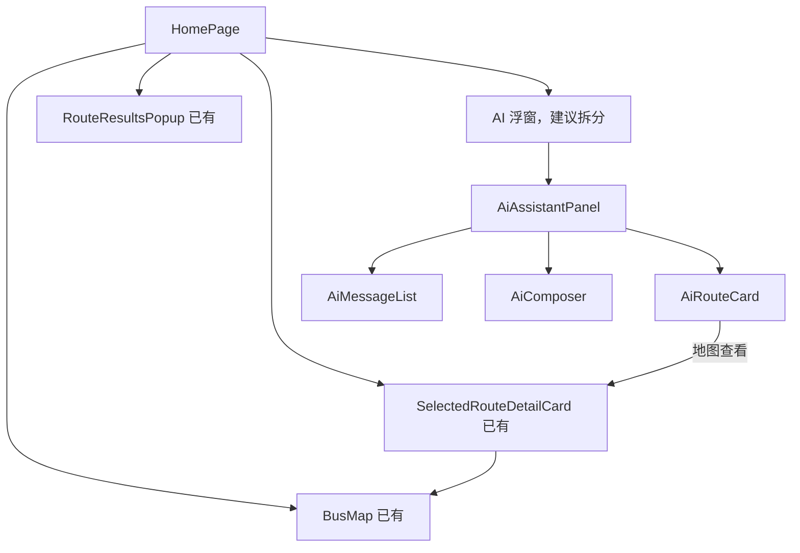

# 前端接入与组件交互说明

> 本文是前后端协作说明，不代表本轮直接修改前端。前端页面和组件由前端负责人实现。

## 1. 接入结论

建议把 `/home` 中现有的地图 AI 浮窗作为正式入口，不新增另一套独立 AI 页面。

原因：

- `/home` 已接入路由和登录布局；
- 已有起终点搜索、推荐路线、地图聚焦和路线详情；
- AI 回答后可以直接把推荐结果投射到地图；
- 独立 `AiAssistantPage.vue` 尚未注册路由，且固定走空上下文 `qa`。

`frontend/src/modules/ai-assistant/` 可以保留。后续若需要完整会话页，应复用同一组无状态组件和会话逻辑，不能复制第二套 API 调用代码。

## 2. 建议组件划分

| 组件 | 建议来源 | 职责 | 是否直接请求 API |
| --- | --- | --- | --- |
| `AiAssistantTrigger` | 从首页浮动按钮提取 | 打开/关闭 AI 面板 | 否 |
| `AiAssistantPanel` | 从首页 `.map-ai-card` 提取 | 展示消息、输入框、加载与错误状态 | 否，触发事件给会话控制层 |
| `AiMessageList` | 可新增 | 渲染用户、AI、追问和错误消息 | 否 |
| `AiComposer` | 可新增 | 输入、发送、快捷问题 | 否 |
| `AiRouteCard` | 从首页 `.ai-route-result` 提取 | 展示 AI 关联路线和操作按钮 | 否 |
| `RouteResultsPopup` | 已存在 | 展示常规路线搜索候选项 | 由首页提供数据 |
| `SelectedRouteDetailCard` | 已存在 | 展示选中路线详情 | 否 |
| `useAiTravelConversation` | 建议新增组合式函数 | 组织请求、会话状态、模式兼容和错误处理 | 是 |

网络请求应集中在 `useAiTravelConversation` 或首页控制层，展示组件只接收 props、抛出事件。

## 3. 已有界面复用关系



不要新建第二个地图、第二套路线上屏组件或第二套推荐结果模型。AI 返回的 `related_routes` 应复用首页现有 `normalizeRecommendation()` 和 `applyRecommendedRoute()` 逻辑。

## 4. 各点击动作与调用关系

### 4.1 点击“AI”浮动按钮

```text
点击 AI
→ toggleAiChat()
→ 切换面板显示状态
→ 不调用任何接口
```

关闭按钮同样只改变本地显示状态，不清除路线搜索结果。

### 4.2 点击常规路线“搜索”

```text
输入起点、终点
→ 点击搜索
→ 搜索位置接口 × 2
→ 获得 start_station_id、end_station_id
→ POST /api/v1/recommend-routes
→ RouteResultsPopup 展示结果
```

AI 助手应直接读取这条现有链路产生的：

- `resolvedJourney.startStationId`；
- `resolvedJourney.endStationId`；
- `rawRouteOptions`；
- 当前选择的路线。

### 4.3 在 AI 面板点击“发送”

当前接口兼容期：

```text
点击发送
→ 有已解析起终点：mode=suggest
→ 无已解析起终点：mode=qa
→ POST /api/v1/ai/travel
→ 展示 answer/reminders
→ related_routes 转为 AiRouteCard
```

后端自动路由上线后，前端不再根据文字猜测意图，统一发送：

```json
{
  "question": "哪条路线不太挤？",
  "conversation_id": "可选会话 ID",
  "start_station_id": 1,
  "end_station_id": 12,
  "context": { "items": ["recommend-routes 返回的完整路线对象"] }
}
```

兼容阶段仍可保留 `mode`，但不建议长期把意图判断写在组件里。

### 4.4 点击 AI 路线卡片“地图查看”

```text
点击地图查看
→ 不重新请求推荐接口
→ applyRecommendedRoute(route)
→ BusMap.focusRouteById()
→ SelectedRouteDetailCard 展示详情
```

只有在路线结果已过期或后端明确要求刷新时才重新查询。

### 4.5 建议新增“为什么推荐”按钮

当前接口兼容期：

```text
点击为什么推荐
→ POST /api/v1/ai/travel
→ mode=explain
→ route_id=当前路线 ID
→ context.items=本次推荐的原始路线
→ 将 answer 追加到当前对话
```

```json
{
  "mode": "explain",
  "question": "为什么推荐这条路线？",
  "route_id": "route-001",
  "context": { "items": [] }
}
```

后端推荐快照上线后，改为传 `recommendation_id + route_id`，不再由前端回传完整路线。

### 4.6 建议新增“换一条”按钮

```text
点击换一条
→ 优先从本次 related_routes/rawRouteOptions 选择下一条
→ 本地更新 AiRouteCard
→ 不调用接口
```

候选路线已遍历完，或用户改变偏好时，才重新请求推荐。

### 4.7 点击快捷问题

快捷问题和手动输入必须走同一个 `send()`，不能单独写请求逻辑。快捷问题只负责填入问题文本，例如“哪条路线最快”“哪条路线不太挤”“为什么推荐这条”。

### 4.8 点击“新建对话”

兼容期只清空消息列表、AI 关联路线和当前会话 ID。不应清空首页地图、起终点和常规路线搜索结果，除非用户主动点击“清除路线”。

## 5. 状态归属

| 状态 | 建议归属 |
| --- | --- |
| 起终点文本、站点 ID | `HomePage` 或行程状态层 |
| 原始推荐路线 | `HomePage` 行程状态层 |
| 地图选中路线 | 地图/首页状态层 |
| AI 消息、加载、错误 | `useAiTravelConversation` |
| AI 当前关联路线 | 会话层，引用原始路线对象 |
| 面板开关 | `HomePage` 或触发器父组件 |

AI 组件不要复制一份路线状态，否则常规搜索结果、AI 推荐结果和地图选中状态容易分叉。

## 6. API 枚举约定

前端必须复用 `frontend/src/api/recommendation.js` 中的偏好常量。P0 后端继续接受 `low_load` 作为旧客户端兼容值，但会规范化成 `comfort`；新代码不再直接写 `low_load`。当前统一为：

```text
balanced
fastest
comfort
less_walking
less_transfer
```

最终枚举以后端 Schema 为准，联调前由前后端共同确认一次。

## 7. 前端验收场景

1. 已搜索起终点后问“哪条不太挤”，AI 使用现有候选路线回答。
2. 点击“地图查看”，不重复请求，地图聚焦到同一条路线。
3. 点击“为什么推荐”，回答针对当前路线。
4. 未提供起终点时询问实时路线，展示后端追问，不伪造结果。
5. DeepSeek 失败时仍展示后端 fallback 和提醒。
6. 关闭再打开 AI 面板不会丢失当前行程。
7. 常规路线搜索和 AI 推荐共享同一套路线对象及地图详情组件。
