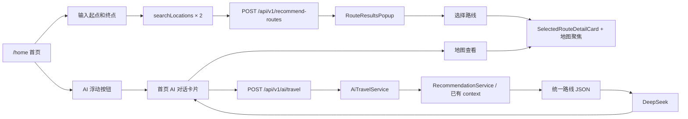
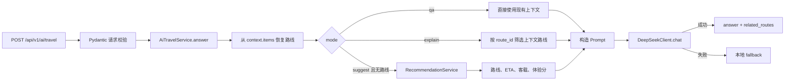
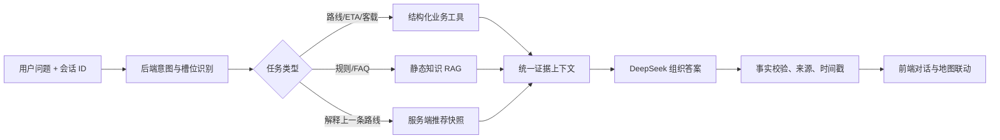

# 大模型助手链路

## 1. 当前正式入口

当前实际接入应用路由的是 `/home`。首页同时承载地图、路线查询和 AI 浮窗。



独立的 `AiAssistantPage.vue` 和 `AiAssistantView.vue` 存在，但路由表没有注册它们，目前不是正式入口。

## 2. 首页路线搜索链路

```text
用户填写起点、终点
→ 点击搜索
→ searchLocations() 分别解析起点和终点
→ getProgressiveRouteRecommendations()
→ POST /api/v1/recommend-routes
→ 保存 rawRouteOptions
→ 转换为 routeOptions
→ RouteResultsPopup 展示候选路线
→ 用户选择路线
→ applyRecommendedRoute()
→ BusMap.focusRouteById()
→ SelectedRouteDetailCard 展示详情
```

这条链路已经具备 AI 助手最需要的起终点、候选路线和地图联动能力，应优先复用。

## 3. 首页 AI 链路

```text
点击 AI 浮动按钮
→ 仅切换 isAiChatOpen，不请求后端
→ 输入问题并发送
→ 检查 resolvedJourney 是否有起终点站 ID
→ 有起终点：mode=suggest
→ 无起终点：mode=qa
→ 携带 rawRouteOptions 前 4 条作为 context.items
→ POST /api/v1/ai/travel
→ 显示 answer
→ 取 related_routes[0] 生成推荐摘要
→ 点击“地图查看”
→ applyRecommendedRoute()
→ 地图聚焦并显示路线详情
```

## 4. 后端 AI 链路



## 5. DeepSeek 的职责边界

DeepSeek 不直接连接数据库，也不直接计算路线、ETA 或客载。它只接收后端整理的结构化路线 JSON，并负责：

- 用自然语言说明推荐结果；
- 比较路线取舍；
- 提醒上下文缺失；
- 输出简洁中文答案。

路线事实来自业务服务，而不是大模型知识。

## 6. 当前失败与降级

以下情况使用后端本地 fallback：

- 未配置 API Key；
- DeepSeek 超时或网络失败；
- DeepSeek 返回 HTTP 错误；
- 响应为空或格式异常。

有路线时 fallback 使用最佳体验路线生成模板答案；没有路线时明确提示缺少可核验数据。

## 7. 目标链路



